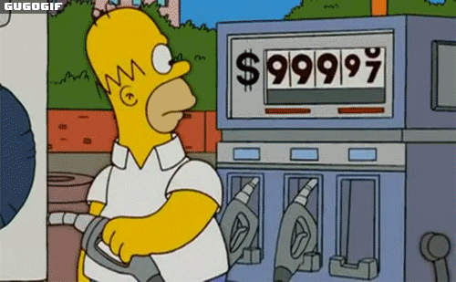

# Engineering_4_Notebook


## Table of Contents
* [Launch Pad #1](#Launch_Pad_#1)
* [Onshape_Assignment_Template](#Onshape_Assignment_Template)


## Launch Pad #1

### Assignment Description

This was a very simple introductory assignment - We had to get a countdown from 10 - 0 on the Terminal Window and print "LIFTOFF" at the end.

### Evidence 

Pictures / Gifs of your work should go here. You need to communicate what your thing does. 

### Wiring

Thankfully, there was no wiring

### Code
``` python

for i in range(10,0,-1):    
    print(i)   
print('LIFTOFF')

```
### Reflection

This was a really easy assignment and I had no troubles with it. All you have to do is insert a for() loop and set an interger to print from 10 to 0.

## Launch Pad #2

### Assignment Description

We had to add onto our previous code and make a red light blink every second and a green light turn on at the end

### Evidence 

Pictures / Gifs of your work should go here. You need to communicate what your thing does. 

### Wiring


### Code
``` python

for i in range(10,0,-1):
#turn on & off led for .5 sec
    led.value = True
    time.sleep(.5)
    print(i)
    led.value = False
    time.sleep(.5)
#turn on green led at end
print('LIFTOFF')
led2.value = True

```
Click [here](https://github.com/shrey45/Engineering_4_Notebook/blob/main/raspberry-pi/launchPad1.py) to view the code (it says part 1 but it's the code for part 2)
### Reflection

Really easy assignment, nothing difficult at all.

## Launch Pad #3

### Assignment Description

Here, we added onto out other code by making a pushbutton initiate our countdown. The spicy version is to also have the button be able to abort the countdown and restart with more presses.

### Evidence 

Pictures / Gifs of your work should go here. You need to communicate what your thing does. 

### Wiring

Thankfully, there was no wiring

### Code
``` python

abortcheck = 0

```
``` python
if not button.value:
        abortcheck = 1
```
``` python
if not button.value:
                print("ABORT")
                time.sleep(1)
                abortcheck = 0
                break
```

These were the new pieces of code. Click [here](https://github.com/shrey45/Engineering_4_Notebook/blob/main/raspberry-pi/launchPad3Spicy.py) to view the full code

### Reflection

This was a super easy assignment, so I did the spicy, which was a little harder but still easy. All I did was add a boolean called abortcheck and assigned "0" or "1" based on if the button was pressed, and then I also have a "break" function to break the loop it is in.

## Launch Pad #4

### Assignment Description

This assignment was to make a servo move 180 degrees at the end of the countdown. The spicy version is to get the servo to sweep to 180 in the last 3 seconds of the countdown.

### Evidence 

Pictures / Gifs of your work should go here. You need to communicate what your thing does. 

### Wiring

Thankfully, there was no wiring

### Code
``` python

if i <= 3: #checks if in last 3 seconds
    led.value = True
    led.value = False
    servo1.angle = 60*(4-i) #moves servo angle to 60,120,180
    time.sleep(0.05)

```
This is the only new chunk of code. Click [here](https://github.com/shrey45/Engineering_4_Notebook/blob/main/raspberry-pi/launchPad4Spicy.py) to view the full code

### Reflection

The regular assignment woudl just need one more line of code with a servo - the spicy was a little hard to conceptualize, but still super easy. I just checked whether it was within the last 3 seconds and then made a small formula for the servo angles in terms of i.

## Crash Avoidance #1

### Assignment Description

We were supposed to wire up an accelerometer and continuously print x, y, and z acceleration values to the serial monitor.

### Evidence 

Pictures / Gifs of your work should go here. You need to communicate what your thing does. 

### Wiring

Thankfully, there was no wiring

### Code
``` python

while True:
    print(f"x = {mpu.acceleration[0]}, y = { mpu.acceleration[1]}, z = {mpu.acceleration[2]}")
    time.sleep(1)        

```
Click [here](https://github.com/shrey45/Engineering_4_Notebook/blob/main/raspberry-pi/crashAvoidance1.py) to view the full code

### Reflection

This got us introduced to how to use an accelerometer (which will be very helpufl in out projects) and how to report values. I also learned how to use f strings which are really cool and helpful because it reduces about 3-5 lines of print code lines to 1 line.

## Crash Avoidance #2

### Assignment Description

This one added on to the last assignment, and we had to light up a green led whenever the board was tilted to 90 degrees. Another side part was also to have it powered by a LiPo battery, but that wasn't really a problem. Just plug it in.
### Evidence 

Pictures / Gifs of your work should go here. You need to communicate what your thing does. 

### Wiring

Thankfully, there was no wiring

### Code
``` python

while True:
    if abs(mpu.acceleration[0]) >= 9 or abs(mpu.acceleration[1]) >= 9:
        led2.value = True
    else:
        led2.value = False   

```
This is the main/only addition from the last one. Click [here](https://github.com/shrey45/Engineering_4_Notebook/blob/main/raspberry-pi/crashAvoidance2.py) to view the full code

### Reflection

Super easy - I had to just add in a few lines with an if statement asking if the x or y values were above ~9 (which was the value around 90 degrees). 

## Crash Avoidance #3

### Assignment Description

Wire up an OLED screen that reports the x, y, and z angular velocity values.

### Evidence 

Pictures / Gifs of your work should go here. You need to communicate what your thing does. 

### Wiring

Thankfully, there was no wiring

### Code
``` python

# create the display group
    splash = displayio.Group()

# add title block to display group
    title = f"x = {mpu.gyro[0]}"
# the order of this command is (font, text, text color, and location)
    text_area = label.Label(terminalio.FONT, text=title, color=0xFFFF00, x=5, y=5)
    splash.append(text_area)

    title1 = f"y = {mpu.gyro[1]}"
# the order of this command is (font, text, text color, and location)
    text_area = label.Label(terminalio.FONT, text=title1, color=0xFFFF00, x=5, y=15)
    splash.append(text_area)

    title2 = f"z = {mpu.gyro[2]}"
# the order of this command is (font, text, text color, and location)
    text_area = label.Label(terminalio.FONT, text=title2, color=0xFFFF00, x=5, y=25)
    splash.append(text_area)        

# you will write more code here that prints the x, y, and z angular velocity values to the screen below the title. Use f strings!
# Don't forget to round the angular velocity values to three decimal places

# send display group to screen
    display.show(splash)
```
This is all the basic code to print to an OLED screen. Click [here](https://github.com/shrey45/Engineering_4_Notebook/blob/main/raspberry-pi/crashAvoidance3.py) to view the full code

### Reflection

The OLED screen wasn't as complicated as it seemed. There were a few basic commands to get something printed to the screen, and other than that, I just had to change the code from acceleration to angular velocity, which was a 1 word swap.

## Landing Area 1 & 2

### Assignment Description

In these two assignments, we had to input 3 coordinates of a triangle, caluculate the area, and then plot the points and make a triangle on an OLED screen.

### Evidence 

Pictures / Gifs of your work should go here. You need to communicate what your thing does. 

### Wiring

Thankfully, there was no wiring

### Code

Click [here](https://github.com/shrey45/Engineering_4_Notebook/blob/main/raspberry-pi/landingArea1.py) to view the full code
Click [here](https://github.com/shrey45/Engineering_4_Notebook/blob/main/raspberry-pi/landingArea2.py) to view the full code

### Reflection

## Onshape_Assignment_Template

### Assignment Description

Write your assignment description here. What is the purpose of this assignment? It should be at least a few sentences.

### Part Link 

[Create a link to your Onshape document](https://cvilleschools.onshape.com/documents/003e413cee57f7ccccaa15c2/w/ea71050bb283bf3bf088c96c/e/c85ae532263d3b551e1795d0?renderMode=0&uiState=62d9b9d7883c4f335ec42021). Don't forget to turn on link sharing in your Onshape document so that others can see it. 

### Part Image

Take a nice screenshot of your Onshape document. 

### Reflection

What went wrong / was challenging, how'd you figure it out, and what did you learn from that experience? Your goal for the reflection is to pass on knowledge that will make this assignment better or easier for the next person. Think about your audience for this one, which may be "future you" (when you realize you need some of this code in three months), me, or your college admission committee!


## Media Test

Your readme will have various images and gifs on it. Upload a test image and test gif to make sure you've got the process figured out. Pick whatever image and gif you want!

### Test Link

[How to make a rocket](https://pbskids.org/)

### Test Image


### Test GIF


