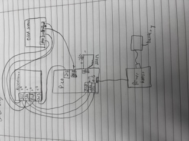

# Engineering_4_Notebook


## Table of Contents
* [Launch Pad #1](#Launch_Pad_1)
* [Launch Pad #2](#Launch_Pad_2)
* [Launch Pad #3](#Launch_Pad_3)
* [Launch Pad #4](#Launch_Pad_4)
* [Crash Avoidance 1](#Crash_Avoidance_1)
* [Crash Avoidance 2](#Crash_Avoidance_2)
* [Landing Area(BOTH)](#Landing_Area)
* [Morse Code 1](#Morse_Code_1)
* [Morse Code 2](#Morse_Code_2)
* [Onshape_Assignment_Template](#Onshape_Assignment_Template)
* [Special Thanks!](#Special_Thanks)


## Launch_Pad_1

### Assignment Description

This was a very simple introductory assignment - We had to get a countdown from 10 - 0 on the Terminal Window and print "LIFTOFF" at the end.

### Evidence 

https://user-images.githubusercontent.com/63983735/198157410-312b2911-d246-433e-bc82-131ca46b2963.mov

### Wiring

Thankfully, there was no wiring

### Code
``` python

for i in range(10,0,-1):    
    print(i)   
print('LIFTOFF')

```
### Reflection

This was a really easy assignment and I had no troubles with it. All you have to do is insert a for() loop and set an interger to print from 10 to 0.

## Launch_Pad_2

### Assignment Description

We had to add onto our previous code and make a red light blink every second and a green light turn on at the end

### Evidence 

https://user-images.githubusercontent.com/63983735/198157540-1b7d27db-2d23-466f-af0f-48d28da1be51.mov

### Wiring


### Code
``` python

for i in range(10,0,-1):
#turn on & off led for .5 sec
    led.value = True
    time.sleep(.5)
    print(i)
    led.value = False
    time.sleep(.5)
#turn on green led at end
print('LIFTOFF')
led2.value = True

```
Click [here](https://github.com/shrey45/Engineering_4_Notebook/blob/main/raspberry-pi/launchPad1.py) to view the code (it says part 1 but it's the code for part 2)
### Reflection

Really easy assignment, nothing difficult at all.

## Launch_Pad_3

### Assignment Description

Here, we added onto out other code by making a pushbutton initiate our countdown. The spicy version is to also have the button be able to abort the countdown and restart with more presses.

### Evidence 

https://user-images.githubusercontent.com/63983735/198157735-de986317-83ba-4274-8708-b61aab024f3e.mov

### Wiring


### Code
``` python

abortcheck = 0

```
``` python
if not button.value:
        abortcheck = 1
```
``` python
if not button.value:
                print("ABORT")
                time.sleep(1)
                abortcheck = 0
                break
```

These were the new pieces of code. Click [here](https://github.com/shrey45/Engineering_4_Notebook/blob/main/raspberry-pi/launchPad3Spicy.py) to view the full code

### Reflection

This was a super easy assignment, so I did the spicy, which was a little harder but still easy. All I did was add a boolean called abortcheck and assigned "0" or "1" based on if the button was pressed, and then I also have a "break" function to break the loop it is in.

## Launch_Pad_4

### Assignment Description

This assignment was to make a servo move 180 degrees at the end of the countdown. The spicy version is to get the servo to sweep to 180 in the last 3 seconds of the countdown.

### Evidence 

https://user-images.githubusercontent.com/63983735/198157804-bf16c9f3-f43b-47c4-bb21-4fcf63d7ba15.mov

### Wiring


### Code

```
if i <= 3: #checks if in last 3 seconds
    led.value = True
    led.value = False
    servo1.angle = 60*(4-i) #moves servo angle to 60,120,180
    time.sleep(0.05)

```
This is the only new chunk of code. Click [here](https://github.com/shrey45/Engineering_4_Notebook/blob/main/raspberry-pi/launchPad4Spicy.py) to view the full code

### Reflection

The regular assignment woudl just need one more line of code with a servo - the spicy was a little hard to conceptualize, but still super easy. I just checked whether it was within the last 3 seconds and then made a small formula for the servo angles in terms of i.

## Crash_Avoidance_1

### Assignment Description

We were supposed to wire up an accelerometer and continuously print x, y, and z acceleration values to the serial monitor.

### Evidence 

https://user-images.githubusercontent.com/63983735/198157965-b8bfef2b-3145-4d4d-8321-6f95b8f93800.mov

### Wiring

Thankfully, there was no wiring

### Code
``` python

while True:
    print(f"x = {mpu.acceleration[0]}, y = { mpu.acceleration[1]}, z = {mpu.acceleration[2]}")
    time.sleep(1)        

```
Click [here](https://github.com/shrey45/Engineering_4_Notebook/blob/main/raspberry-pi/crashAvoidance1.py) to view the full code

### Reflection

This got us introduced to how to use an accelerometer (which will be very helpufl in out projects) and how to report values. I also learned how to use f strings which are really cool and helpful because it reduces about 3-5 lines of print code lines to 1 line.

## Crash_Avoidance_2

### Assignment Description

This one added on to the last assignment, and we had to light up a green led whenever the board was tilted to 90 degrees. Another side part was also to have it powered by a LiPo battery, but that wasn't really a problem. Just plug it in.
### Evidence 

https://user-images.githubusercontent.com/63983735/198158030-ad1dd5ff-8b01-41d7-bebb-5063d7477d45.mov

### Wiring


### Code
``` python

while True:
    if abs(mpu.acceleration[0]) >= 9 or abs(mpu.acceleration[1]) >= 9:
        led2.value = True
    else:
        led2.value = False   

```
This is the main/only addition from the last one. Click [here](https://github.com/shrey45/Engineering_4_Notebook/blob/main/raspberry-pi/crashAvoidance2.py) to view the full code

### Reflection

Super easy - I had to just add in a few lines with an if statement asking if the x or y values were above ~9 (which was the value around 90 degrees). 

## Crash_Avoidance_3

### Assignment Description

Wire up an OLED screen that reports the x, y, and z angular velocity values.

### Evidence 


Credit: [Ellen Lynch](https://github.com/elynch78/Engineering4Notebook)

### Wiring



### Code
``` python

# create the display group
    splash = displayio.Group()

# add title block to display group
    title = f"x = {mpu.gyro[0]}"
# the order of this command is (font, text, text color, and location)
    text_area = label.Label(terminalio.FONT, text=title, color=0xFFFF00, x=5, y=5)
    splash.append(text_area)

    title1 = f"y = {mpu.gyro[1]}"
# the order of this command is (font, text, text color, and location)
    text_area = label.Label(terminalio.FONT, text=title1, color=0xFFFF00, x=5, y=15)
    splash.append(text_area)

    title2 = f"z = {mpu.gyro[2]}"
# the order of this command is (font, text, text color, and location)
    text_area = label.Label(terminalio.FONT, text=title2, color=0xFFFF00, x=5, y=25)
    splash.append(text_area)        

# you will write more code here that prints the x, y, and z angular velocity values to the screen below the title. Use f strings!
# Don't forget to round the angular velocity values to three decimal places

# send display group to screen
    display.show(splash)
```
This is all the basic code to print to an OLED screen. Click [here](https://github.com/shrey45/Engineering_4_Notebook/blob/main/raspberry-pi/crashAvoidance3.py) to view the full code

### Reflection

The OLED screen wasn't as complicated as it seemed. There were a few basic commands to get something printed to the screen, and other than that, I just had to change the code from acceleration to angular velocity, which was a 1 word swap.


## Landing_Area

### Assignment Description

In these two assignments, we had to input 3 coordinates of a triangle, caluculate the area, and then plot the points and make a triangle on an OLED screen. The first one was to have just the area calculated and printed on the REPL. The second one was plotting the points.

LA1 - Enter coordinates and generate traingle area

LA2 - Same as LA1 + graph traingle on OLED screen

### Evidence 

https://user-images.githubusercontent.com/63983735/198158356-7bf65323-b295-4371-82c7-9e00e29244bc.mov

### Wiring


### Code

LA1 - Click [here](https://github.com/shrey45/Engineering_4_Notebook/blob/main/raspberry-pi/landingArea1.py) to view the full code

LA2 - Click [here](https://github.com/shrey45/Engineering_4_Notebook/blob/main/raspberry-pi/landingArea2.py) to view the full code

### Reflection

LA1 - This assignment I would say is pretty code heavy. The hardest part is to conceptually think about what your code it going to do, and what you need it to do. Then actually writing it out is pretty hard too. I found that there are many ways to write the same code, but there are definately easier ways. I have a really easy and tidy way to do the assignment, which also helped in the next ones b/c it was really easy to add on to.

LA2 - This one was also pretty easy b/c of how I made the code in the first one - I just needed to connect my OLED screen to it and add a few lines of code creating lines and circles based off coordinates.

## Morse_Code_1

### Assignment Description

In this assignment, we had to create code that would take user input and convert it to morse code.

### Evidence 

https://user-images.githubusercontent.com/63983735/198158584-17e3a748-1128-4bfb-bd6e-e12d76896160.mov

### Wiring

Thankfully, there was no wiring

### Code

``` python

MORSE_CODE = { 'A':'.-', 'B':'-...',
    'C':'-.-.', 'D':'-..', 'E':'.',
    'F':'..-.', 'G':'--.', 'H':'....',
    'I':'..', 'J':'.---', 'K':'-.-',
    'L':'.-..', 'M':'--', 'N':'-.',
    'O':'---', 'P':'.--.', 'Q':'--.-',
    'R':'.-.', 'S':'...', 'T':'-',
    'U':'..-', 'V':'...-', 'W':'.--',
    'X':'-..-', 'Y':'-.--', 'Z':'--..',
    '1':'.----', '2':'..---', '3':'...--',
    '4':'....-', '5':'.....', '6':'-....',
    '7':'--...', '8':'---..', '9':'----.',
    '0':'-----', ', ':'--..--', '.':'.-.-.-',
    '?':'..--..', '/':'-..-.', '-':'-....-',
    '(':'-.--.', ')':'-.--.-'}
    
```
Click [here](https://github.com/shrey45/Engineering_4_Notebook/blob/main/raspberry-pi/morseCode1.py) to view the full code (this is both parts combined)


### Reflection

This was a pretty cool assignmnet because I used libraries for the first time - All the letters were stored with the morse code equivalent and we could just call them easily with [letter] whenever we want. Otherwise, it was a pretty simple assignment.

## Morse_Code_2

### Assignment Description

This assignment had us just adding an led to our wiring so that it would blink in certain ways before every tap, hold, between taps, between words, and more. We just had to add a few lines that defined how long the led would stay on for in case of each part of the morse code, and then implemented that with a few if statements.

### Evidence 

https://user-images.githubusercontent.com/63983735/198158753-2468a18c-96bf-4cf5-ab43-da9e89b4351b.mov

### Wiring


### Code

``` python

modifier = 0.25
dot_time = 1*modifier
dash_time = 3*modifier
between_taps = 1*modifier
between_letters = 3*modifier
between_words = 7*modifier
```
These are both the additions from MC1 ⬆️ ⬇️

``` python
for character in final:
    if character == ".":
        led.value = True
        time.sleep(dot_time)
    if character == "-":
        led.value = True
        time.sleep(dash_time)
    if character == "/":
        led.value = True
        time.sleep(between_words)
    if character == "":
        led.value = True
        time.sleep(between_letters)
```
Click [here](https://github.com/shrey45/Engineering_4_Notebook/blob/main/raspberry-pi/morseCode1.py) to view the full code

### Reflection

This wasn't hard at all, we just added a few lines for led and added on to our previous code. The libraries again made it super easy to check everything and to call everything, and without those, it could be a SUPER long assignment.


## Onshape_Assignment_Template

## FEA 1

### Assignment Description

Gaby and I had to build a bridge to support mass.

### Onshape 

[Onshape](https://cvilleschools.onshape.com/documents/cb8b9bb78bdf1ee50d84757e/w/4ef288967c0ae586b1b96682/e/b2ab5e21880641ecd136b936)  

### Evidence


### Reflection

We designed a beam to be able to withsand bending and an unknown ammount of mass. We will add weights until the bridghe either snaps or bends past a certain point (<35mm). We learned that simple is sometimes better than a complicated design.

## FEA 2 

### Assignment Description

We had to test our beam in Simscale Workflow to test the flexibility and resistance of the beam. 

### Part Link 

[Create a link to your Onshape document](https://cvilleschools.onshape.com/documents/003e413cee57f7ccccaa15c2/w/ea71050bb283bf3bf088c96c/e/c85ae532263d3b551e1795d0?renderMode=0&uiState=62d9b9d7883c4f335ec42021). Don't forget to turn on link sharing in your Onshape document so that others can see it. 

### Part Image


### Reflection

We found that our initial beam design was not so great, and the beam bent WAYYY to much at one point. We hadn't really thought through what the structure would be doing, so it ended up faltering at one point that was just the bottom of the beam. We used this to make our next designs more space conscious. 

## FEA 3


### Assignment Description

We had to test our beam in Simscale Workflow to test the flexibility and resistance of the beam. 

### Part Link 

[Create a link to your Onshape document](https://cvilleschools.onshape.com/documents/003e413cee57f7ccccaa15c2/w/ea71050bb283bf3bf088c96c/e/c85ae532263d3b551e1795d0?renderMode=0&uiState=62d9b9d7883c4f335ec42021).  

### Part Image


### Reflection

After doing a bunch of simscale testing, we realized that we were just trying to do too much in our design. It ended up working better when we had a more basic version, which is what we ended up with. The fina; results of our modified Beam were WAYYY better than the first version we made. We had a few other version in between (which you can look at through the version history), but this was by far the best. Lesson: beauty is in simplicity (not that I've ever abided by that even after this).

## 4.1 Ring and Spinner

### Assignment Description

The purpose of this assignment is to refresh and relearn our skills in Onshape. The task is to create and design a ring and a spinner 

### Part Link 

[Link to the Ring and Spinner](https://cvilleschools.onshape.com/documents/8616b8a375e597ac84230d17/w/24a18f8c93de24401fba89ea/e/5fe78ceeb2398b3504d84b42?renderMode=0&uiState=640f2f1e61c40226d1bda0a9). 

### Part Image

 

### Reflection

What went wrong / was challenging, how'd you figure it out, and what did you learn from that experience? Your goal for the reflection is to pass on knowledge that will make this assignment better or easier for the next person. Think about your audience for this one, which may be "future you" (when you realize you need some of this code in three months), me, or your college admission committee!

## 4.2 Key and Prop

### Assignment Description

This is a refresher course in Onshape. The task is to create and design a ring and a spinner for a helicopter toy called a "Pull Copter." In this assignment, I was Student B and Quinn [@qragsda80](https://github.com/qragsda80) was Student A. I created the Spinner & Prop part of the assignment.
### Part Link 

[Link to the Spinner & Prop](https://cvilleschools.onshape.com/documents/8616b8a375e597ac84230d17/w/24a18f8c93de24401fba89ea/e/094a17de0ba520f009130882).  

### Part Image


### Reflection

It was a pretty easy assignment to be completely honest - there were guided instructions so there was no way to be stuck or have trouble, and the part design was fairly simple too.

## 4.3 Assembling the Launcher

### Assignment Description

This is part of our 3 step Onshape refresher course. This was the assembly assignment to put together the entire pull copter.
### Part Link 

[Link to the Assembly](https://cvilleschools.onshape.com/documents/8616b8a375e597ac84230d17/w/24a18f8c93de24401fba89ea/e/5d6f1ec0c09f80c20c19635d). 

### Part Image

https://github.com/shrey45/Engineering_4_Notebook/assets/63983735/a25eb37d-3e25-4410-aeb2-18d924a2c781

### Reflection

Again, super easy. The guided assignment told you exactly what to do, and I was familiar with the mates and functions that it was requiring me to use.

## Media Test

Your readme will have various images and gifs on it. Upload a test image and test gif to make sure you've got the process figured out. Pick whatever image and gif you want!

### Test Link

[How to make a rocket](https://pbskids.org/)

### Test Image


### Test GIF


---

## Special_Thanks

**All Code Wiring Diagrams - Credit: [Ellen Lynch](https://github.com/elynch78/Engineering4Notebook)**

**All Code Evidence(videos) - Credit: [Quinn Ragsdale](https://github.com/qragsda80/Engineering_4_Notebook)**

I had A LOT of outside Github problems with my videos and wiring and lost all of it through some event, so appreciate fellow classmates for their help or I would spend hours more trying to recreate wiring and make videos. 🫡🫡🫡

Special Thanks again to [Quinn Ragsdale](https://github.com/qragsda80/Engineering_4_Notebook) for getting me off task but also somehow keeping me on task (only some times). I'm not sure how that works ask him.  


---
